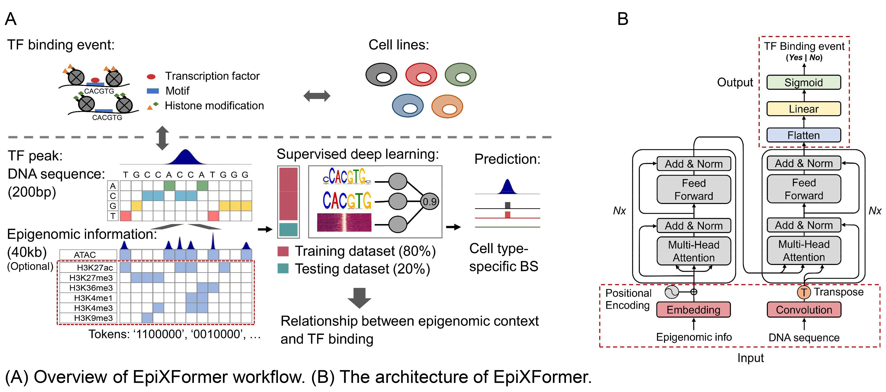

## Introduction

**EpiXFormer** is a transformer-based neural network for cell type-specific binding site prediction of DNA binding proteins (DBPs). As shown in the figure, EpiXFormer employs an encoder-decoder architecture to extract features from input DNA sequence and epigenomic information and predict transcription factor (TF) binding events in distinct cell lines. EpiXFormer can predict binding landscapes for any TF in cell lines of interest, provided we first train a dedicated model for that TF. This would offer valuable biological insights while mitigate the efficiency and cost limitations of ChIP-seq experiments.

## Requirements

- [Python](https://www.python.org/) (v3.9.16)
- matplotlib (v3.7.1)
- numpy (v1.22.3)
- pandas (v1.4.2)
- pyranges (v0.0.127)
- scipy (v1.10.1)
- seaborn (v0.12.2)
- [Tensorflow](https://www.tensorflow.org/) (v2.12.0)
- [NeuronMotif](https://github.com/wzthu/NeuronMotif) (Zheng Wei et al. PNAS. 2023)
- [FIMO](https://meme-suite.org/meme/doc/fimo.html?man_type=web) (v5.5.1)

## Training your own EpiXFormer model

We have collected training datasets of 32 DBPs from [ENCODE project](https://www.encodeproject.org/) and trained corresponding models. The robust model weights are provided in *models* folder.

We also provide training scripts implemented in [Jupyter notebooks](https://jupyter.org/), with CTCF-GM12878 serving as the example case. Training steps are as follow:

### 1. Prepare dataset

*prepare_dataset.ipynb* performs this processing step. You need to prepare:

1. DBP binding site information (typically detected by ChIP-seq experiment with genomic coordinates determined by peak calling using [MACS2](https://github.com/macs3-project/MACS/wiki/Install-macs2) software);
2. Epigenetic profiles (ATAC-seq data is the minimum requirement, and other assays are optional);
3. Reference genome sequence, **hg38** for human and **mm10** for mouse are recommended, which can be downloaded from [GENCODE](https://www.gencodegenes.org/).

### 2. Train model

*train_model.ipynb* is used for training and logging the corresponding weights files.

### 3. Model interpretation

*explain_model.ipynb* executes this step with dual interpretability outputs:

1. DNA binding motif analysis;
2. Epigenetic context effects on protein binding.

### 4. Make prediction

We have demonstrated that EpiXFormer possesses cross-cell type predictive capability. Consequently, for a TF of intrest, model trained on one or multiple cell types can be applied to predict binding event in unseen cell types. The *make_prediction.ipynb* script implements this functionality.

---

Additional methodological details are available in our publication [TBD]().
